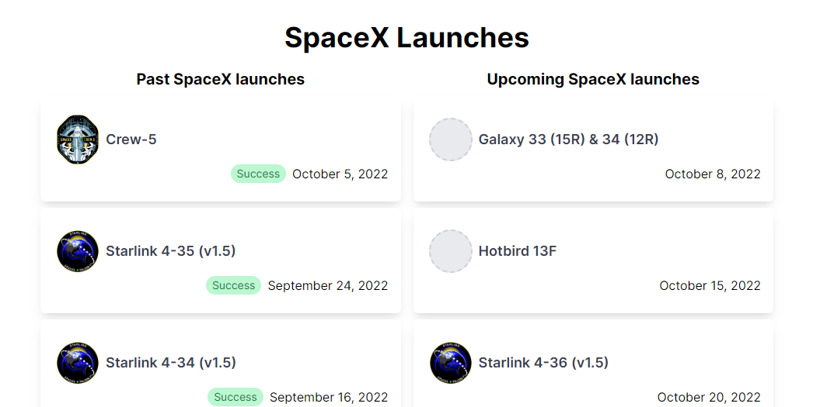
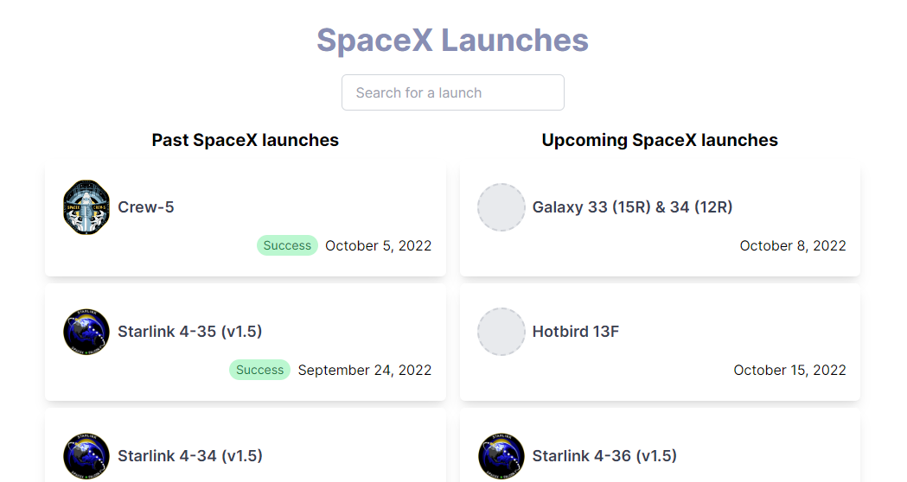

<div align="center">

<small>[Português 🇧🇷](README.pt-BR.md)</small>

<h1 style="display: inline-flex; gap: 10px"> SpaceX Launches</h1>

Coding assignment by Callix

</div>

---

## Running the project

Install dependencies:

```bash
pnpm install
```

Run the NextJS dev server:

```bash
pnpm dev
```

---

## [Backend (API)](./src/pages/api)

API routes are served by NextJS HTTP router based on handlers' file paths:

### [`GET /api/launches/past`](./src/pages/api/launches/past.ts)

Fetches past SpaceX launches

### [`GET /api/launches/upcoming`](./src/pages/api/launches/upcoming.ts)

Fetches upcoming SpaceX launches

### [`GET /api/launches/latest`](./src/pages/api/launches/latest.ts)

Fetches latest SpaceX launch

### [`GET /api/launches/next`](./src/pages/api/launches/next.ts)

Fetches next SpaceX launch

## [Frontend](./src/pages/index.tsx)

It displays the past and upcoming launches from the API and has 2 variants controlled by Google Optimize A/B test experiment:

### Variant A: Original

Just the simple display of launches lists.



### Variant B: With Search Input

Besides having the same lists, it allows you to filter the launches by name or some term mentioned in the details text and I've also changed the page title to a slightly blueish color using the Google Optimize editor just to make sure it isn't the variant A.


