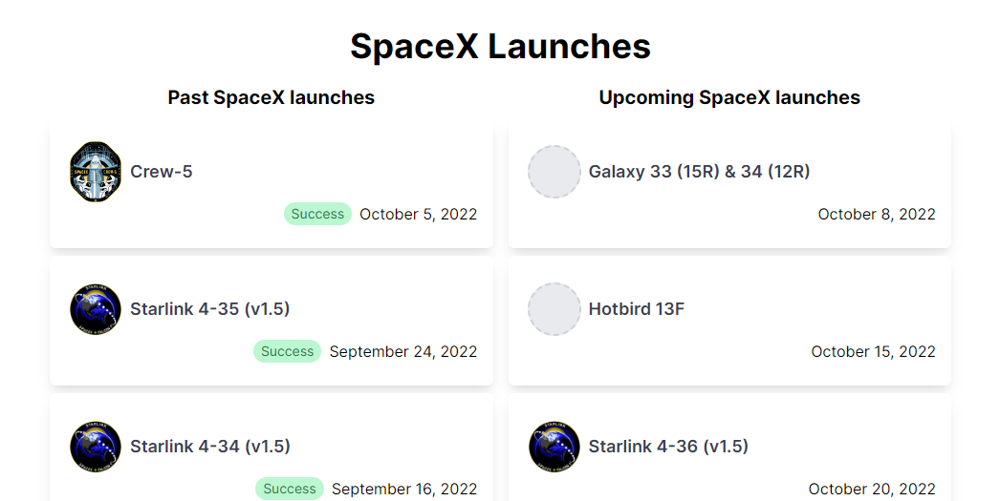
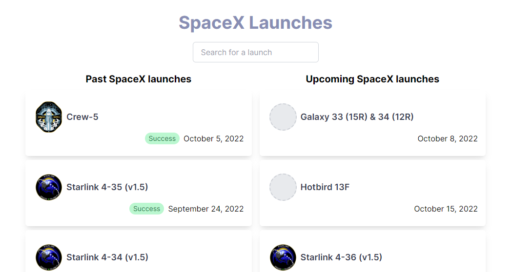

<div align="center">

<small>[English](README.md)</small>

<h1> SpaceX Launches</h1>

Desafio técnico da Callix

</div>

## Iniciar o projeto

Instale as dependências:

```bash
pnpm install
```

Rode o servidor de desenvolvimento do NextJS:

```bash
pnpm dev
```

Acesse http://localhost:3000

## [Backend (API)](./src/pages/api)

As rotas da API são servidas pelo roteador HTPP do NextJS baseado no caminho do arquivo das funções:

### [`GET /api/launches/past`](./src/pages/api/launches/past.ts)

Retorna lançamentos passados da SpaceX

### [`GET /api/launches/upcoming`](./src/pages/api/launches/upcoming.ts)

Retorna lançamentos futuros da SpaceX

### [`GET /api/launches/latest`](./src/pages/api/launches/latest.ts)

Retorna o último lançamento da SpaceX

### [`GET /api/launches/next`](./src/pages/api/launches/next.ts)

Retorna o próximo lançamento da SpaceX

## [Frontend](./src/pages/index.tsx)

It displays the past and upcoming launches from the API and has 2 variants controlled by Google Optimize experiment:

Mostra os lançamentos passados e furutos retornados pela API e possui 2 varantes controladas pelo experimento de teste A/B criado no Google Optimize.

### Variante A: Original

Apenas mostra as listas de lançamentos passados e futuros.



### Variante B: Com campo de pesquisa

Além de mostrar as listas, permite que você filtre os lançamentos pelo nome ou algum termo mencionado nos detalhes e eu também fiz uma pequena mudança na cor do título usando o editor do Google Optimize apenas para certificar que não é a variante A.


